 # Évaluation de modèles d'embeddings de topic

Une plateforme d'évaluation pour les topic models neuronaux (BERTopic, Top2Vec) basée sur 3 métriques : cohérence, retrieval et diversité.

## Table des matières

- [Installation](#installation)
- [Modèles](#modèles)
  - [Top2Vec](#top2vec)
  - [BERTopic](#bertopic)
- [Métriques d'évaluation](#métriques-dévaluation)
  - [Cohérence](#cohérence)
  - [Retrieval](#retrieval)
  - [Diversité](#diversité)
- [Architecture](#architecture)
  - [Structure des modules](#structure-des-modules)
  - [Choix d'architecture](#choix-darchitecture)
- [Datasets](#datasets)
  - [20 Newsgroups](#20-newsgroups)
  - [AG News](#ag-news)
  - [ArXiv](#arxiv)
  - [Big Patent](#big-patent)
  - [BioRxiv](#biorxiv)
  - [ClusTREC-Covid](#clustrec-covid)
- [Résultats](#résultats)
  - [Observations Cohérence](#observations-cohérence)
  - [Observations Cohésion](#observations-cohésion)
  - [Observations Retrieval](#observations-retrieval)
  - [Observations Diversité](#observations-diversité)

## Installation

```bash
pip install -r requirements.txt
```

## Modèles

Ce projet se concentre sur l'évaluation de deux modèles d'embeddings pour comprendre la signification sémantique des documents.
Durant nos entraînements, nous avons fait varier le paramètre **nr_topics** qui correspond au nombre de topics que le modèle doit créer. 

### Top2Vec

Top2Vec est un algorithme de modélisation thématique et de recherche sémantique. Il détecte automatiquement les thèmes présents dans le texte et génère des vecteurs de thèmes, de documents et de mots représentés conjointement dans un même espace vectoriel.

Pour entraîner ce modèle nous avons choisie les paramètres suivants (disponible dans le fichier [config](./library/embeddingTopicEvaluatorLib/config/config.py):
```
"UMAP" : {
    "n_neighbors" : 15, # Taille du voisinage local (plus élevé = vision plus globale)
    "n_components" : 10, # Dimension de sortie pour le clustering
    "min_dist" : 0.0, # Distance min entre les points
    "metric" : "cosine" # Métrique de distance
},
        
"EmbeddingModel" : EMBEDDING_MODEL,
        
"TOP2VEC" : {
    # Modèle de Sentence Transformers utilisé pour les embeddings
    "embedding_model" : "paraphrase-multilingual-MiniLM-L12-v2",
    "min_count" : 5, # Nombre minimum d'occurrences d'un mot pour être pris en compte
    "nr_topics" : ..., # Nombre de topics à générer
    "verbose" : True, # Affiche la barre de progression
    "n_components" : 10 # Nombre de mots par Topics
}
```
Pour ce modèle, nous avons choisi d'utiliser le model [paraphrase-multilingual-MiniLM-L12-v2](https://huggingface.co/sentence-transformers/paraphrase-multilingual-MiniLM-L12-v2) car c’était l’option la plus performante à ce moment-là. 

### BERTopic

BERTopic est un framework moderne de modélisation thématique qui répond à de nombreuses limites des approches traditionnelles. Développé par Maarten Grootendorst , il utilise des plongements (embeddings) basés sur des transformeurs (comme BERT) pour comprendre la signification sémantique des documents et les regrouper en clusters en fonction de leur contexte, plutôt que de se baser uniquement sur la fréquence des mots.

Pour entraîner ce modèle nous avons choisie les paramètres suivants (disponible dans le fichier [config](./library/embeddingTopicEvaluatorLib/config/config.py):
```
"UMAP" : {
    "n_neighbors" : 50, # Taille du voisinage local (plus élevé = vision plus globale)
    "n_components" : 10, # Dimension de sortie pour le clustering
    "min_dist" : 0.0, # Distance min entre les points
    "metric" : "cosine" # Métrique de distance
},
"HDBSCAN" : {
    "min_cluster_size" : 50, # Taille min d'un topic
    "min_samples" : 1, # Sensibilité au bruit (plus bas = moins d'exclus)
    "metric" :"euclidean", # Distance standard après UMAP
    "cluster_selection_method" : "eom", # Sélection des clusters les plus denses
    "prediction_data" : True # Permet de classer de nouveaux documents
},
"EmbeddingModel" : EMBEDDING_MODEL, 
    
"BERTopic" : {
    # Modèle de Sentence Transformers utilisé pour les embeddings
    "embedding_model" : "all-mpnet-base-v2",
    "nr_topics" : ... , # Réduction automatique du nombre de topics si nécessaire
    "verbose" : True # Affiche la barre de progression
}
```
Pour ce modèle, nous avons choisi d'utiliser le model [all-mpnet-base-v2](https://www.sbert.net/docs/sentence_transformer/pretrained_models.html) car c’était l’option la plus performante à ce moment-là.

## Métriques d'évaluation

Ce projet utilise quatre métriques d'évaluation pour évaluer les performances des modèles. Ces métriques sont la cohérence, le retrieval, la diversité et la cohésion.
Pour calculer ces métriques, on utilise un modèle différant, cela permet de comparer les 2 modèles indépendamment de leurs représentations internes des embeddings. Bien sûr, il est toujours possible de calculer les métriques en fonction du modèle de production d'embedding interne. Pour information, la métrique de cohésion est calculée sur les embeddings interne. 

Le modèle choisi pour faire la comparaison est [sentence-transformers/all-MiniLM-L6-v2](https://huggingface.co/sentence-transformers/all-MiniLM-L6-v2), nous avons choisi ce modèle, car il a été entraîné sur un très grand nombre de données de type texte plus de 1 milliard. Ce modèle a été créé pour encoder des phrases et de courts paragraphes. À partir d'un texte d'entrée, il produit un vecteur qui capture l'information sémantique. Ce vecteur peut être utilisé pour la recherche d'informations, le regroupement de données ou l'analyse de similarité entre phrases.

### Cohérence

Cette métrique mesure la cohérence sémantique de chaque topic en calculant la similarité cosinus entre les embeddings de toutes les paires uniques de mots qui le composent (triangle supérieur de la matrice de similarité, diagonale exclue), puis en faisant la moyenne de ces similarités. Un score proche de 1 indique un topic cohérent dont les mots sont fortement liés sémantiquement.
Par exemple : 
Le topic : ["voiture", "camion", "véhicule", "roue"] doit avoir un score de cohérence élevé car tous les mots sont liés sémantiquement.
Alors que, le topic : ["voiture", "pomme", "véhicule", "roue"] doit avoir un score de cohérence faible car les mots ne sont pas tous liés sémantiquement.

### Retrieval

Cette métrique calcule la fidélité aux documents du topic en utilisant la méthode TREC. Cette approche soumet des requêtes dont chacune d'elles nous retourne les documents correspondant au topic fourni. On utilise deux métriques pour évaluer le retrieval :

- MAP (Mean Average Precision) : C'est la moyenne des précisions moyennes pour chaque requête.
- NDCG (Normalized Discounted Cumulative Gain) : C'est la moyenne des gains cumulés normalisés pour chaque requête.

### Diversité

Cette métrique permet de vérifier si le modèle créé des topics éloigner du point de vue des embeddings. On fait cela, pour vérifier si notre modelé réparti bien les topics dans l'espace, car si deux topics sont trop rapprocher, il pourrait y avoir une confusion lors du placement d'un nouveau document. Pour calculer cette métrique, il y a 2 cas le premier, on utilise le modèle d'embedding interne qui vas calcul le centroide des topics (la moyenne des embeddings des mots qui définisse le topics), puis on va comparer ces centroide entre eu avec une similarité cosinus. On fini par prendre la valeur de similarité du centroide le plus proche qu'on va soustraire à 1, puis on fait la moyenne pour chaque centroide. Le deuxième cas est très semblable au premier sauf qu'on va transformer les mots du topic une phrase par exemple le topic : ["voiture", "camion", "véhicule", "roue"] va devenir "voiture camion véhicule roue", on va créer un embedding de cette phrase avec un modèle externe puis le reste est identique à la première méthode. Le but de cette métrique est donc d'être maximisé. 

### Cohésion

Cette métrique compare pour un topic si en calculant le centroide des mots qui le définisse (la moyenne des embeddings des mots qui définisse le topics) et l'embedding de la phrase composer des mots qui définissent le topics. Si on se retrouve avec une similarité cosinus élever, cela veux dire les mots qui définissent notre topics le représente bien. Par défaut, cette métrique est calculée sur les embedding produit par le modèle interne. 

## Architecture

Le projet est organisé en une librairie Python installable (`embeddingTopicEvaluatorLib`) dont la structure reflète une séparation claire des responsabilités.

### Structure des modules

```text
embeddingTopicEvaluatorLib/
├── models/          # Wrappers des modèles de topics
│   ├── base.py      # Classe de base abstraite TopicModelEvaluator
│   ├── bertopic_wrapper.py
│   └── top2vec_wrapper.py
├── metrics/         # Métriques d'évaluation (fonctions pures)
│   ├── coherence.py
│   ├── cohesion.py
│   ├── diversity.py
│   └── retrieval.py
├── utils/           # Fonctions utilitaires partagées
│   └── embeddings.py
├── config/          # Configuration globale
└── tests/           # Tests unitaires
```

### Choix d'architecture

#### Pattern Wrapper avec classe de base abstraite

Chaque modèle de topics (BERTopic, Top2Vec) est encapsulé dans un **wrapper** héritant de la classe de base `TopicModelEvaluator`. Ce pattern a été choisi pour :

- **Standardiser l'interface** : l'unification des méthodes (`getTopicWords()`, `getTopicsKeys()`, etc.) permet aux métriques de fonctionner de manière indépendante du modèle utilisé.
- **Faciliter l'extensibilité** : ajouter un nouveau modèle revient à créer un nouveau wrapper implémentant `TopicModelEvaluator`, sans modifier les métriques existantes.
- **Isoler la complexité** : chaque wrapper gère les spécificités de son modèle (API différente de BERTopic vs Top2Vec) de manière transparente pour le reste du code.

#### Métriques implémentées comme fonctions pures

Les quatres métriques (`coherence`, `diversity`, `retrieval`, `cohesion`) sont implémentées comme des **fonctions indépendantes** (et non des classes) prenant un `TopicModelEvaluator` en paramètre. Ce choix offre :

- **Simplicité** : une fonction sans état est plus facile à tester et à comprendre.
- **Composabilité** : les métriques peuvent être appelées indépendamment ou combinées librement.
- **Paramétrage explicite** : la fonction `diversity()` accepte par exemple une fonction de distance injectable (`cosine_similarity` par défaut), rendant le comportement facilement configurable sans sous-classer.

#### Séparation utils / metrics

Les calculs d'embeddings partagés (e.g. `calculCentroide`) sont isolés dans `utils/embeddings.py` pour éviter la duplication entre les métriques et conserver des fonctions de calcul réutilisables.

## Datasets

### [20 Newsgroups](https://www.kaggle.com/datasets/crawford/20-newsgroups/data)

Le dataset 20 Newsgroups est une collection de 18 846 articles de newsgroups répartis en 20 catégories thématiques (politique, religion, sport, science, informatique, etc.). Il constitue un benchmark classique pour la classification et le clustering de texte.

### [AG News](https://huggingface.co/datasets/wangrongsheng/ag_news)

Le dataset AG News regroupe 127 600 articles de presse (120 000 train + 7 600 test) issus de plus de 2 000 sources, répartis en 4 catégories : *World*, *Sports*, *Business* et *Sci/Tech*. Il est fréquemment utilisé comme benchmark de classification de texte court. Nous utilisons ici la version de train du dataset.

### [ArXiv](https://huggingface.co/datasets/mteb/arxiv-clustering-s2s)

Le dataset ArXiv est un ensemble de données de 31 articles de presse répartis en 4 catégories. Il est utilisé pour évaluer les performances des modèles de classification de texte.

### [Big Patent](https://huggingface.co/datasets/jinaai/big-patent-clustering)

Le dataset Big Patent Clustering (variante Jina AI) est un sous-ensemble du dataset Big Patent, contenant des brevets répartis en 9 catégories CPC (Cooperative Patent Classification). Il est conçu pour le clustering de documents longs. Nous utilisons ici la version "Big Patent Clustering" du dataset contenant 3 documents.

### [BioRxiv](https://huggingface.co/datasets/mteb/biorxiv-clustering-p2p)

Le dataset BioRxiv (variante MTEB `biorxiv-clustering-p2p`) contient 53 787 paires titre+résumé d'articles de biologie préprint, répartis en 26 catégories disciplinaires (neurosciences, microbiologie, génomique, bioinformatique, etc.). Nous utilisons ici la variante "biorxiv-clustering-p2p" du dataset.

### [ClusTREC-Covid](https://huggingface.co/datasets/Uri-ka/ClusTREC-Covid)

Le dataset ClusTREC-Covid est une adaptation du dataset TREC-COVID pour le clustering. Il contient 6 852 articles scientifiques sur la COVID-19 (titres + résumés), regroupés en 50 topics thématiques (e.g., *réponse du coronavirus aux changements météorologiques*). Nous utilisons ici la version "ClusTREC-Covid" du dataset.

## Résultats

### Observations Cohérence

#### BERTopic – 20 Newsgroups

La cohérence démarre à ~0.230 pour k=2, monte progressivement jusqu'à un pic à ~0.271 pour k=18, puis redescend graduellement pour se stabiliser autour de ~0.252–0.255 à partir de k=34. Le modèle produit ses topics les plus cohérents autour de k=18, ce qui correspond au nombre réel de catégories du dataset (~20). Au-delà, les topics deviennent trop spécifiques et commencent à mélanger des termes moins liés sémantiquement.

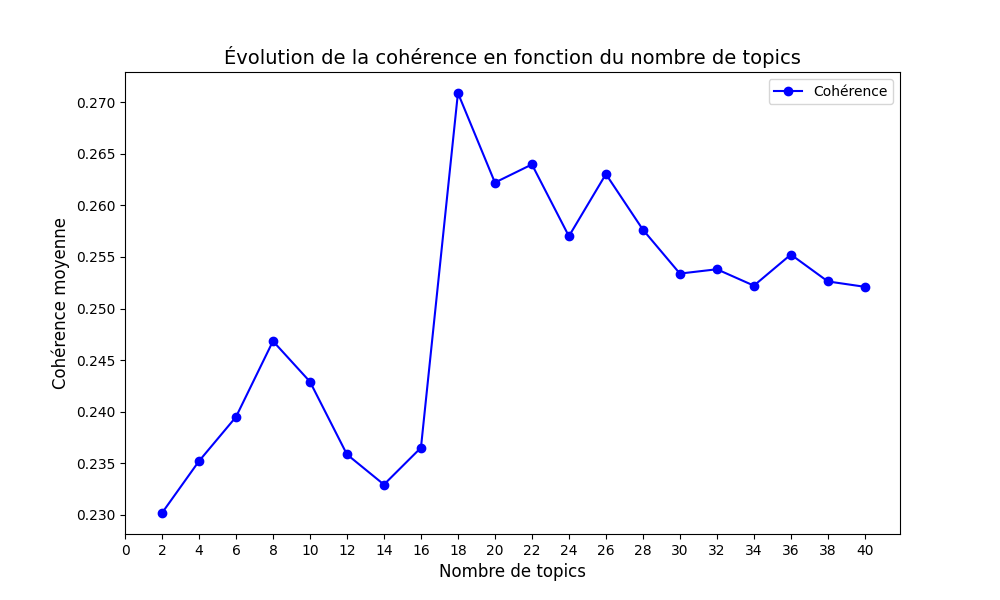

#### Top2Vec – 20 Newsgroups

La cohérence commence à ~0.628 pour k=2, monte rapidement à ~0.725 pour k=6, puis oscille entre ~0.68 et ~0.725 avec des pics locaux à k=6 et k=14. Au-delà de k=26, la courbe redescend légèrement autour de ~0.68–0.70. Top2Vec atteint des scores de cohérence nettement plus élevés que BERTopic sur ce dataset, ce qui signifie que ses mots-clés par topic sont sémantiquement plus proches. Le modèle regroupe efficacement les mots dès k=6 et reste stable, même si l'augmentation du nombre de topics finit par diluer légèrement la qualité.

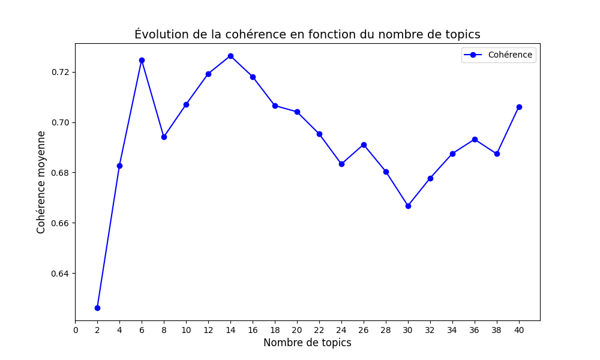

#### BERTopic – AG News

La cohérence démarre à ~0.237 pour k=10, augmente fortement jusqu'à ~0.312 vers k=70–80, puis se stabilise en plateau autour de ~0.305–0.312 avec de légères oscillations pour les valeurs de k supérieures. Avec seulement 4 catégories réelles dans AG News, le modèle a besoin de plus de topics pour capturer des sous-thèmes spécialisés et cohérents. La stabilisation en plateau montre que BERTopic maintient une bonne qualité sémantique même avec un grand nombre de topics.

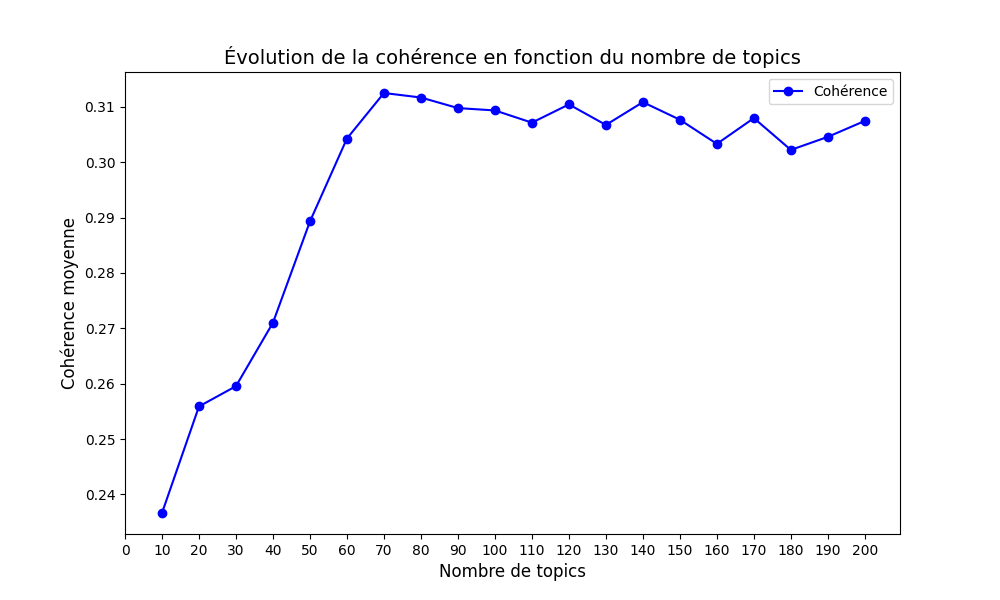

#### Top2Vec – AG News

La cohérence commence à ~0.492 pour k=10, chute à ~0.465 pour k=20, puis remonte progressivement pour atteindre un pic à ~0.527 vers k=90. Au-delà, la courbe oscille autour de ~0.505–0.517 avec quelques variations. Top2Vec affiche là aussi des scores de cohérence bien supérieurs à BERTopic. La chute initiale à k=20 suggère que le modèle peine à bien segmenter les 4 grandes catégories en sous-groupes, mais retrouve sa cohérence en créant des topics plus fins à partir de k=50.

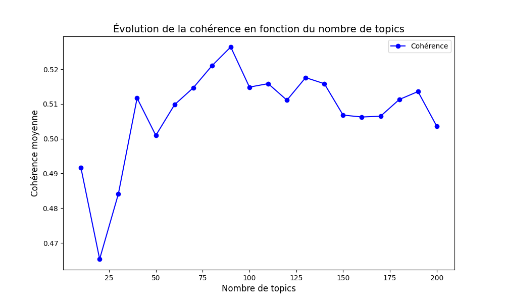

---

### Observations Cohésion

#### BERTopic – 20 Newsgroups

La cohésion montre un comportement très oscillant. Elle démarre à ~0.447 pour k=2, monte rapidement à ~0.497 pour k=4, puis alterne entre des pics (~0.503 à k=8) et des creux (~0.451 à k=24). La tendance générale est irrégulière avec une légère remontée en fin de courbe (~0.485 à k=40). Ces oscillations indiquent que la représentation interne des topics par BERTopic est instable : certains topics sont bien résumés par leurs mots-clés (pics), tandis que d'autres contiennent des mots dont les embeddings ne forment pas un groupe compact (creux).

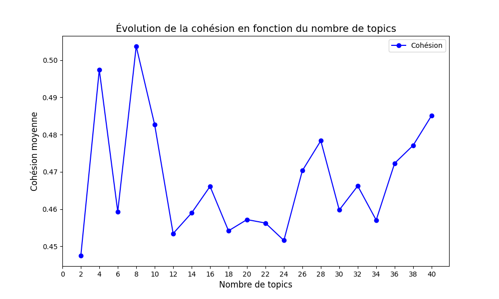

#### Top2Vec – 20 Newsgroups

La cohésion part de ~0.550 pour k=2, monte rapidement à ~0.693 pour k=6, puis se stabilise en plateau autour de ~0.675–0.693 avec un léger creux vers k=26 (~0.670). La courbe est globalement stable avec peu de variations au-delà de k=6. Top2Vec produit des topics dont les mots-clés sont très bien alignés avec le centroïde du topic dans l'espace d'embeddings interne, ce qui montre une bonne représentativité des mots choisis quel que soit le nombre de topics.

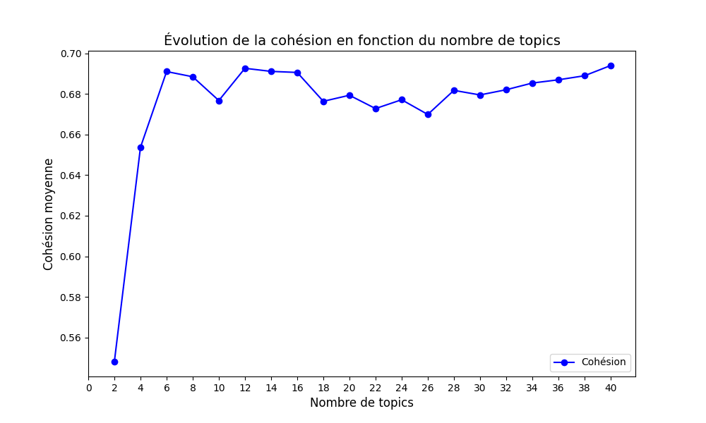

#### BERTopic – AG News

La cohésion part de ~0.473 pour k=10, augmente progressivement jusqu'à ~0.583 vers k=90, puis se stabilise en plateau autour de ~0.575–0.583 pour les valeurs de k supérieures. Plus le nombre de topics augmente, plus chaque topic devient spécialisé et ses mots-clés se rapprochent du centroïde du topic. Le plateau indique que BERTopic atteint un seuil de spécialisation au-delà duquel les topics restent bien représentés par leurs mots.

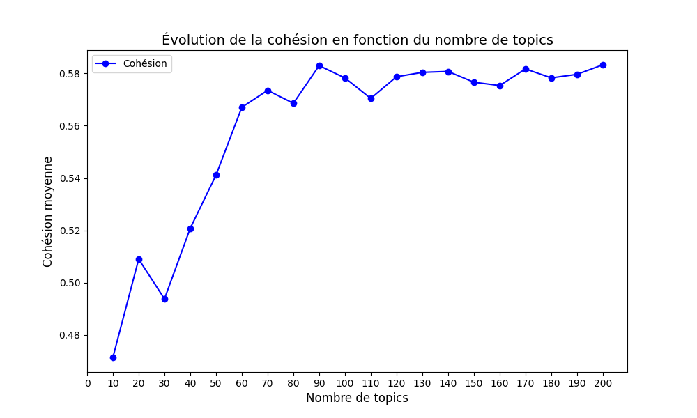

#### Top2Vec – AG News

La cohésion oscille dans une plage étroite entre ~0.705 et ~0.722 sur l'ensemble des valeurs de k. On observe des pics à k=20 (~0.722) et k=40 (~0.721), un creux à k=30 (~0.705), puis une stabilisation autour de ~0.715 avec des oscillations régulières. Top2Vec maintient une cohésion élevée et très stable sur AG News, ce qui signifie que les mots-clés de chaque topic restent fidèles à la représentation interne du topic, indépendamment du nombre de topics demandé.

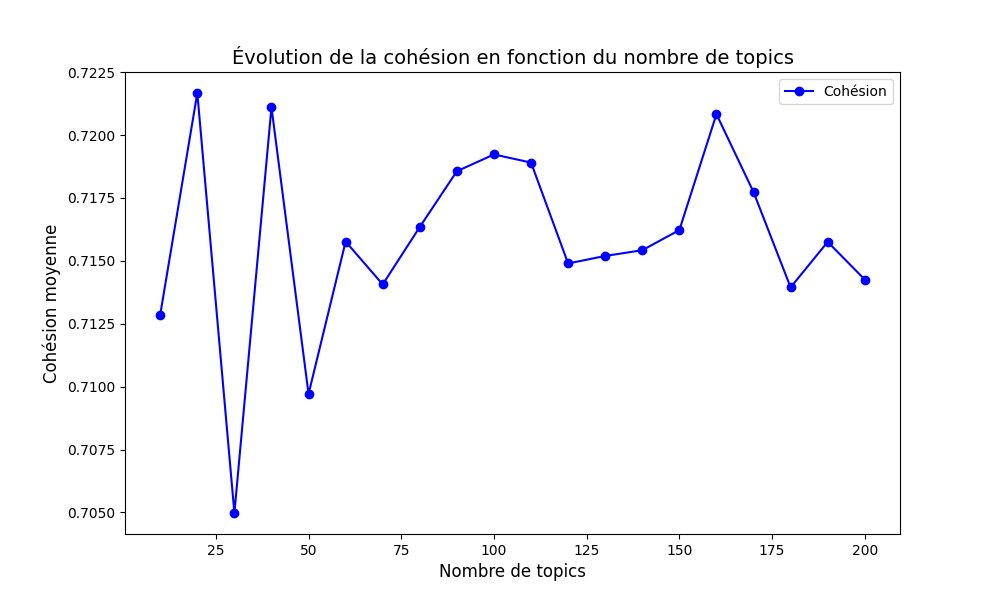

---

### Observations Retrieval

#### BERTopic – 20 Newsgroups

Le NDCG démarre à ~1.0 pour k=2, chute à ~0.755 pour k=8–10, puis remonte progressivement pour se stabiliser autour de ~0.87 à partir de k=28. Le MAP suit la même tendance : il part de ~0.98 pour k=2, descend fortement à ~0.22 pour k=8, puis remonte graduellement jusqu'à ~0.55–0.57 pour les grands k. Avec peu de topics (k=2), le retrieval est parfait car chaque topic couvre un large éventail de documents. La chute vers k=8 montre que le modèle crée des topics mal alignés avec les vrais groupes de documents, mais la remontée au-delà de k=20 indique qu'en augmentant le nombre de topics, BERTopic retrouve une meilleure correspondance avec les catégories du dataset.

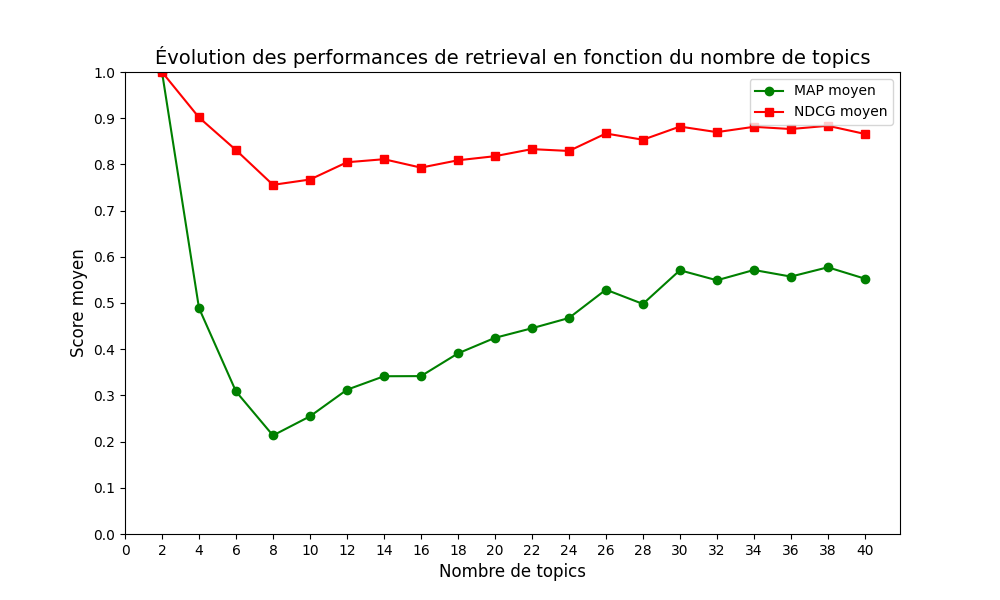

#### Top2Vec – 20 Newsgroups

Le NDCG et le MAP décroissent tous les deux de manière monotone. Le NDCG passe de ~0.99 (k=2) à ~0.84 (k=40). Le MAP descend fortement de ~0.86 (k=2) à ~0.42 (k=40), avec une chute plus marquée entre k=2 et k=6. Contrairement à BERTopic, Top2Vec perd en qualité de retrieval quand on augmente le nombre de topics : les topics deviennent trop fragmentés et les requêtes ne retrouvent plus aussi fidèlement les documents pertinents.

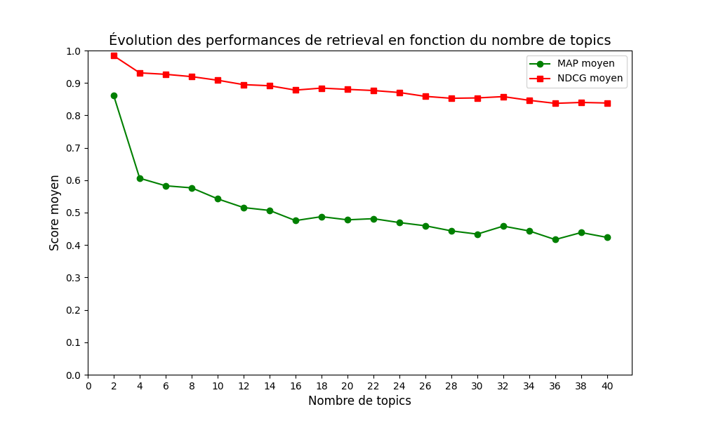

#### BERTopic – AG News

Les performances de retrieval sont très stables. Le NDCG reste quasiment constant autour de ~0.94–0.95 sur toute la plage de k. Le MAP est également stable autour de ~0.70–0.76, avec un léger creux à k=30 (~0.67) suivi d'une remontée. BERTopic gère très bien AG News pour le retrieval : les 4 catégories claires du dataset permettent au modèle de maintenir des topics bien alignés avec les documents, quel que soit le nombre de topics choisi.

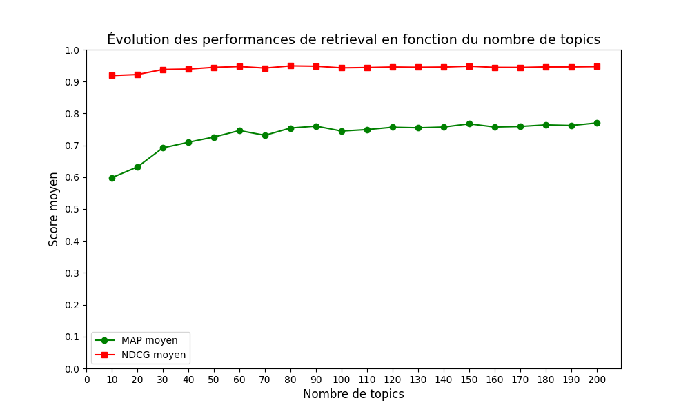

#### Top2Vec – AG News

Le NDCG et le MAP décroissent de manière régulière et monotone. Le NDCG passe de ~0.94 (k=10) à ~0.81 (k=200). Le MAP descend de ~0.59 (k=10) à ~0.36 (k=200), de façon presque linéaire. Top2Vec perd progressivement en fidélité de retrieval sur AG News : avec un grand nombre de topics, le modèle crée des sous-groupes trop fins qui ne correspondent plus aux documents réels, ce qui dégrade la précision des requêtes.

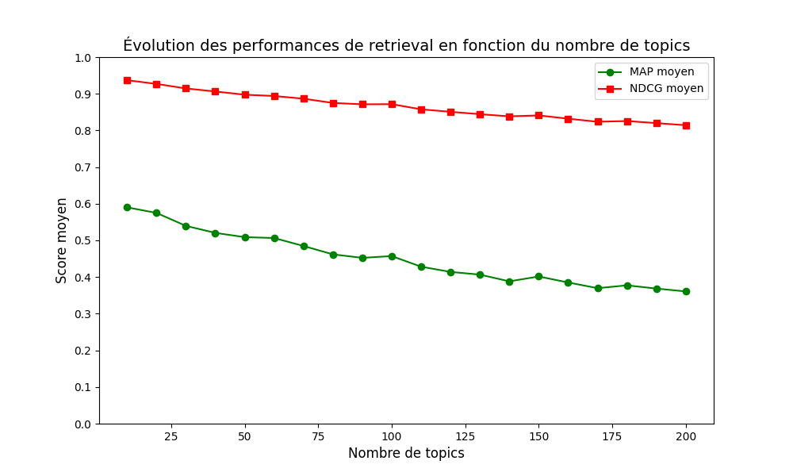

---

### Observations Diversité

#### BERTopic – 20 Newsgroups

La diversité augmente de manière quasi monotone. Elle part de ~0.365 pour k=4, connaît un minimum à ~0.345 pour k=8, puis croît régulièrement pour atteindre ~0.635 vers k=34. La courbe se stabilise ensuite autour de ~0.62–0.635 pour les plus grands k. Avec peu de topics, BERTopic crée des groupes trop larges qui se chevauchent dans l'espace d'embeddings. En augmentant k, chaque topic se spécialise et s'éloigne des autres, ce qui explique la hausse de diversité.

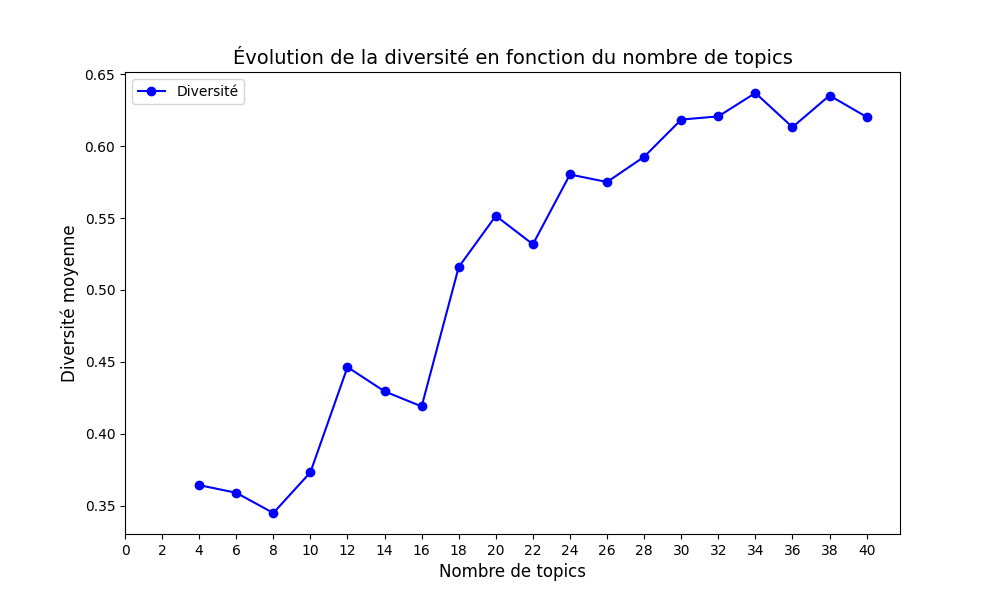

#### Top2Vec – 20 Newsgroups

La diversité décroît globalement. Elle démarre très haute à ~1.05 pour k=2, chute à ~0.83 pour k=4, puis continue de baisser avec des oscillations. On observe un rebond entre k=18 et k=26 (~0.72), mais la tendance baissière reprend ensuite pour atteindre ~0.64 à k=40. Avec 2 topics seulement, la diversité est maximale car les deux groupes sont naturellement éloignés. En augmentant k, Top2Vec crée des topics de plus en plus proches dans l'espace d'embeddings, ce qui réduit la diversité et peut mener à de la confusion lors du placement de nouveaux documents.

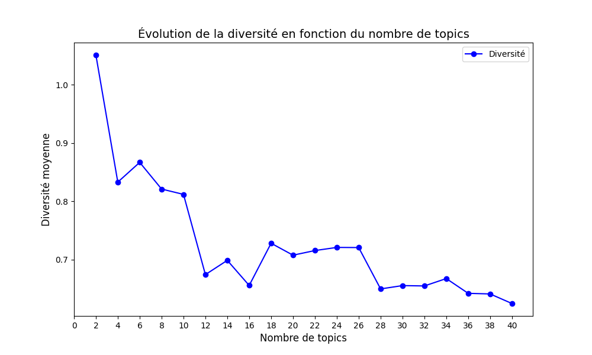

#### BERTopic – AG News

La diversité décroît de manière régulière. Elle atteint un pic à ~0.78 pour k=30, puis diminue progressivement jusqu'à ~0.64 pour k=200, avec un léger rebond autour de k=100 (~0.70). BERTopic produit des topics bien séparés autour de k=30, ce qui est cohérent avec la structure simple d'AG News (4 catégories). Au-delà, les sous-topics créés commencent à se rapprocher dans l'espace vectoriel, réduisant la diversité.

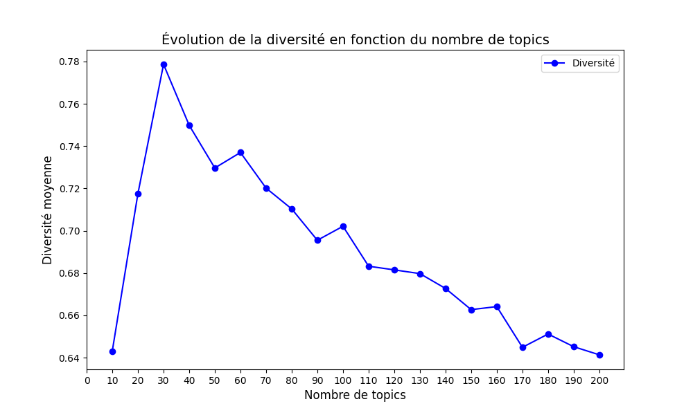

#### Top2Vec – AG News

La diversité décroît presque linéairement. Elle part de ~0.77 pour k=10 et descend régulièrement jusqu'à ~0.35 pour k=200, sans variations notables. Top2Vec perd fortement en diversité avec un grand nombre de topics : le modèle crée des topics de plus en plus rapprochés, ce qui indique que les embeddings ne permettent pas de maintenir une bonne séparation au-delà d'un faible nombre de topics.

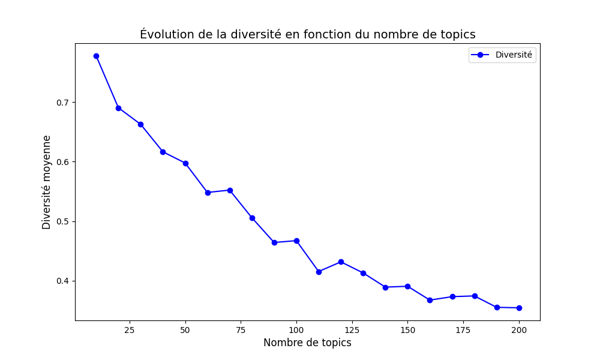
